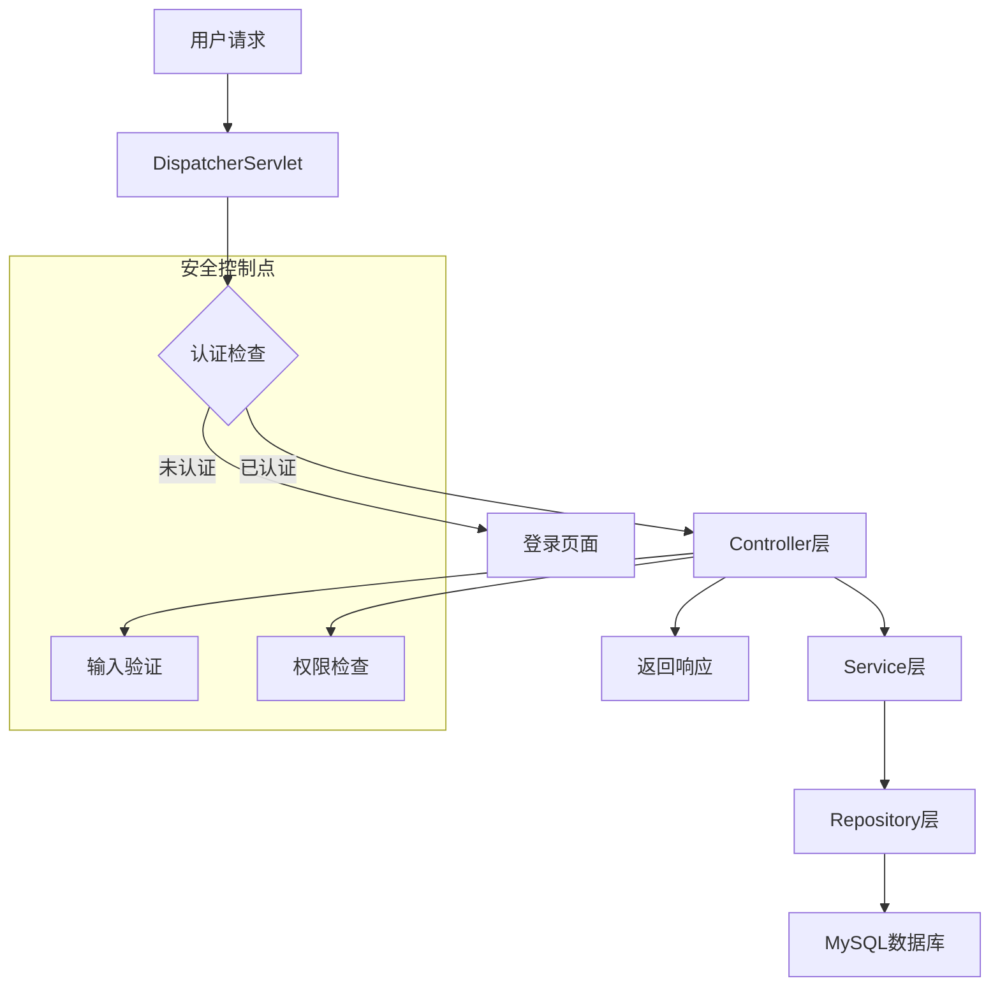
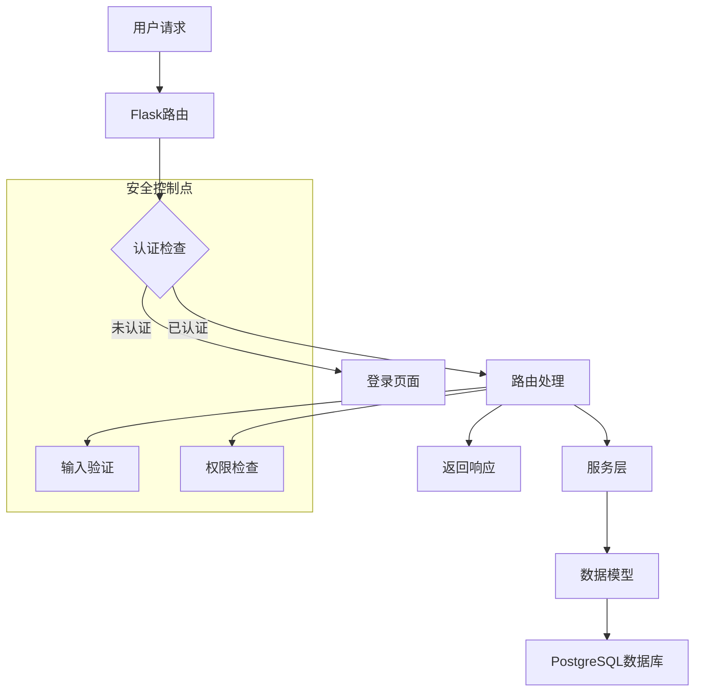

# 审计示例

## 1. Java Web应用审计示例

### 1.1 项目概述
- **项目类型**：Spring Boot Web应用
- **技术栈**：Java 11, Spring Boot 2.7.0, MySQL 8.0
- **审计目标**：识别SQL注入、认证绕过、XSS等漏洞

### 1.2 Phase 1: 侦察与绘图

#### 1.2.1 项目结构分析
```java
src/
├── main/
│   ├── java/
│   │   ├── com/example/
│   │   │   ├── controller/
│   │   │   ├── service/
│   │   │   ├── repository/
│   │   │   └── entity/
│   │   └── config/
│   └── resources/
│       ├── application.yml
│       └── static/
└── test/
    └── java/
```

#### 1.2.2 入口点识别
- **Controller层**：
  - `UserController.java` - 用户管理接口
  - `ProductController.java` - 产品管理接口
  - `AdminController.java` - 管理后台接口
- **API路由**：
  - `/api/users/*` - 用户相关API
  - `/api/products/*` - 产品相关API
  - `/api/admin/*` - 管理相关API

#### 1.2.3 Mermaid架构图


### 1.3 Phase 2: 并行模式匹配

#### 1.3.1 SQL注入检测
**发现的潜在SQL注入点**：

1. **UserController.java:45**
```java
@GetMapping("/users/{id}")
public User getUserById(@PathVariable Long id) {
    String sql = "SELECT * FROM users WHERE id = " + id;
    return jdbcTemplate.query(sql, new UserRowMapper());
}
```
**风险等级**：High
**修复建议**：使用参数化查询

2. **ProductController.java:78**
```java
@PostMapping("/products/search")
public List<Product> searchProducts(@RequestParam String keyword) {
    String sql = "SELECT * FROM products WHERE name LIKE '%" + keyword + "%'";
    return jdbcTemplate.query(sql, new ProductRowMapper());
}
```
**风险等级**：High
**修复建议**：使用参数化查询

#### 1.3.2 认证绕过检测
**发现的潜在认证绕过点**：

1. **SecurityConfig.java:23**
```java
@Override
protected void configure(HttpSecurity http) throws Exception {
    http
        .authorizeRequests()
            .antMatchers("/api/admin/**").permitAll()  // 管理接口未认证
            .anyRequest().authenticated()
        .and()
        .formLogin();
}
```
**风险等级**：Critical
**修复建议**：移除permitAll()，添加认证检查

#### 1.3.3 XSS检测
**发现的潜在XSS点**：

1. **UserController.java:67**
```java
@GetMapping("/users/{username}")
public String getUserProfile(@PathVariable String username) {
    User user = userService.findByUsername(username);
    return "<div>Welcome, " + user.getName() + "!</div>";  // 未转义输出
}
```
**风险等级**：Medium
**修复建议**：使用HTML转义

### 1.4 Phase 3: 深度污点追踪

#### 1.4.1 数据流追踪
**追踪路径**：`UserController.getUserById()`

1. **Source**：`@PathVariable Long id` (用户输入)
2. **Filter**：无输入验证
3. **Service**：`userService.findById(id)`
4. **Sink**：`jdbcTemplate.query(sql, ...)`

**数据流分析**：
- 用户输入直接拼接到SQL语句
- 缺少输入验证和类型检查
- 存在SQL注入风险

#### 1.4.2 优先级决策
**审计优先级**：
1. **P0 (Critical)**：SecurityConfig.java - 认证绕过
2. **P1 (High)**：UserController.java - SQL注入
3. **P2 (Medium)**：UserController.java - XSS

### 1.5 Phase 4: 验证与攻击链构建

#### 1.5.1 漏洞验证
**SQL注入验证**：
```bash
# 测试SQL注入
curl -X GET "http://example.com/api/users/1 OR 1=1"
```
**预期结果**：返回所有用户数据

**认证绕过验证**：
```bash
# 测试管理接口未认证访问
curl -X GET "http://example.com/api/admin/users"
```
**预期结果**：成功访问管理接口

#### 1.5.2 攻击链构建
**组合攻击链**：
1. 攻击者通过认证绕过访问管理接口
2. 在管理接口中利用SQL注入获取所有用户数据
3. 使用XSS攻击窃取管理员会话

**综合风险等级**：Critical

### 1.6 Phase 5: 结构化报告

#### 1.6.1 漏洞详情
| 编号 | 类型 | 位置 | 严重程度 | 修复建议 |
|------|------|------|----------|----------|
| VULN-001 | SQL注入 | UserController.java:45 | High | 使用参数化查询 |
| VULN-002 | 认证绕过 | SecurityConfig.java:23 | Critical | 添加认证检查 |
| VULN-003 | XSS | UserController.java:67 | Medium | 使用HTML转义 |

#### 1.6.2 修复建议

**SQL注入修复**：
```java
@GetMapping("/users/{id}")
public User getUserById(@PathVariable Long id) {
    String sql = "SELECT * FROM users WHERE id = ?";
    return jdbcTemplate.queryForObject(sql, new Object[]{id}, new UserRowMapper());
}
```

**认证绕过修复**：
```java
@Override
protected void configure(HttpSecurity http) throws Exception {
    http
        .authorizeRequests()
            .antMatchers("/api/admin/**").hasRole("ADMIN")  // 添加角色检查
            .anyRequest().authenticated()
        .and()
        .formLogin();
}
```

**XSS修复**：
```java
@GetMapping("/users/{username}")
public String getUserProfile(@PathVariable String username, Model model) {
    User user = userService.findByUsername(username);
    model.addAttribute("user", user);
    return "user-profile";  // 使用模板自动转义
}
```

## 2. Python Flask应用审计示例

### 2.1 项目概述
- **项目类型**：Flask Web应用
- **技术栈**：Python 3.9, Flask 2.3.0, PostgreSQL 13
- **审计目标**：识别SSTI、SQL注入、CSRF等漏洞

### 2.2 Phase 1: 侦察与绘图

#### 2.2.1 项目结构分析
```python
app/
├── __init__.py
├── routes/
│   ├── __init__.py
│   ├── auth.py
│   ├── user.py
│   └── admin.py
├── services/
│   ├── user_service.py
│   └── product_service.py
├── models/
│   ├── user.py
│   └── product.py
├── templates/
│   ├── index.html
│   └── admin.html
└── config.py
```

#### 2.2.2 入口点识别
- **路由入口**：
  - `/auth/*` - 认证相关路由
  - `/user/*` - 用户相关路由
  - `/admin/*` - 管理相关路由

#### 2.2.3 Mermaid架构图


### 2.3 Phase 2: 并行模式匹配

#### 2.3.1 SSTI检测
**发现的潜在SSTI点**：

1. **user.py:34**
```python
@app.route('/user/<username>')
def user_profile(username):
    template = 'Hello {{ user.name }}, welcome to the system!'
    return render_template_string(template, user={'name': username})  # SSTI漏洞
```
**风险等级**：High
**修复建议**：使用安全的模板渲染方法

#### 2.3.2 SQL注入检测
**发现的潜在SQL注入点**：

1. **user_service.py:23**
```python
def get_user_by_id(user_id):
    sql = f"SELECT * FROM users WHERE id = {user_id}"
    return db.execute(sql).fetchone()
```
**风险等级**：High
**修复建议**：使用参数化查询

#### 2.3.3 CSRF检测
**发现的潜在CSRF点**：

1. **admin.py:45**
```python
@app.route('/admin/delete-user', methods=['POST'])
def delete_user():
    user_id = request.form.get('user_id')
    # 缺少CSRF Token验证
    user_service.delete_user(user_id)
    return redirect('/admin/users')
```
**风险等级**：Medium
**修复建议**：添加CSRF Token验证

### 2.4 Phase 3: 深度污点追踪

#### 2.4.1 数据流追踪
**追踪路径**：`user_profile()`

1. **Source**：`username` (用户输入)
2. **Filter**：无输入验证
3. **Service**：`user_service.get_user_by_name(username)`
4. **Sink**：`render_template_string(template, ...)`

**数据流分析**：
- 用户输入直接传递给模板渲染
- 缺少输入验证和沙箱保护
- 存在SSTI风险

#### 2.4.2 优先级决策
**审计优先级**：
1. **P0 (High)**：user.py - SSTI
2. **P1 (High)**：user_service.py - SQL注入
3. **P2 (Medium)**：admin.py - CSRF

### 2.5 Phase 4: 验证与攻击链构建

#### 2.5.1 漏洞验证
**SSTI验证**：
```bash
# 测试SSTI
curl -X GET "http://example.com/user/{{config.__class__.__init__.__globals__['os'].popen('id').read()}}"
```
**预期结果**：执行系统命令

**SQL注入验证**：
```bash
# 测试SQL注入
curl -X GET "http://example.com/api/user/1' OR '1'='1"
```
**预期结果**：返回所有用户数据

#### 2.5.2 攻击链构建
**组合攻击链**：
1. 攻击者利用SSTI获取服务器权限
2. 利用SQL注入获取敏感数据
3. 利用CSRF删除管理员账户

**综合风险等级**：Critical

### 2.6 Phase 5: 结构化报告

#### 2.6.1 漏洞详情
| 编号 | 类型 | 位置 | 严重程度 | 修复建议 |
|------|------|------|----------|----------|
| VULN-001 | SSTI | user.py:34 | High | 使用SandboxedEnvironment |
| VULN-002 | SQL注入 | user_service.py:23 | High | 使用参数化查询 |
| VULN-003 | CSRF | admin.py:45 | Medium | 添加CSRF Token |

#### 2.6.2 修复建议

**SSTI修复**：
```python
@app.route('/user/<username>')
def user_profile(username):
    template = 'Hello {{ user.name }}, welcome to the system!'
    return render_template_string(template, user={'name': username}, sandbox=True)  # 添加沙箱保护
```

**SQL注入修复**：
```python
def get_user_by_id(user_id):
    sql = "SELECT * FROM users WHERE id = %s"
    return db.execute(sql, (user_id,)).fetchone()
```

**CSRF修复**：
```python
@app.route('/admin/delete-user', methods=['POST'])
def delete_user():
    user_id = request.form.get('user_id')
    csrf_token = request.form.get('csrf_token')
    if not validate_csrf_token(csrf_token):
        return "CSRF Token验证失败", 403
    user_service.delete_user(user_id)
    return redirect('/admin/users')
```

## 3. 审计最佳实践

### 3.1 审计流程
1. **系统化审计**：按照五阶段协议逐步执行
2. **优先级管理**：优先审计高风险区域
3. **证据收集**：收集足够的代码证据
4. **验证测试**：对发现的漏洞进行验证
5. **报告生成**：生成详细的审计报告

### 3.2 工具使用
1. **静态分析**：使用SonarQube、Bandit等工具
2. **动态测试**：使用OWASP ZAP、Burp Suite等工具
3. **依赖扫描**：使用Snyk、Safety等工具
4. **配置扫描**：使用Trufflehog、GitLeaks等工具

### 3.3 持续改进
1. **知识库更新**：将新发现的漏洞模式加入知识库
2. **工具优化**：根据审计经验优化工具配置
3. **流程改进**：基于审计结果改进审计流程
4. **技能提升**：学习新的攻击技术和防御方法
