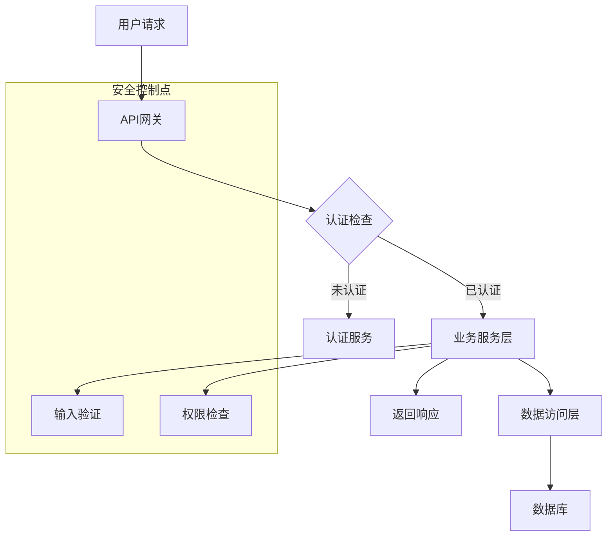
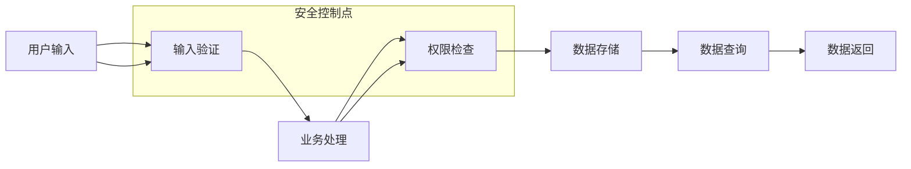
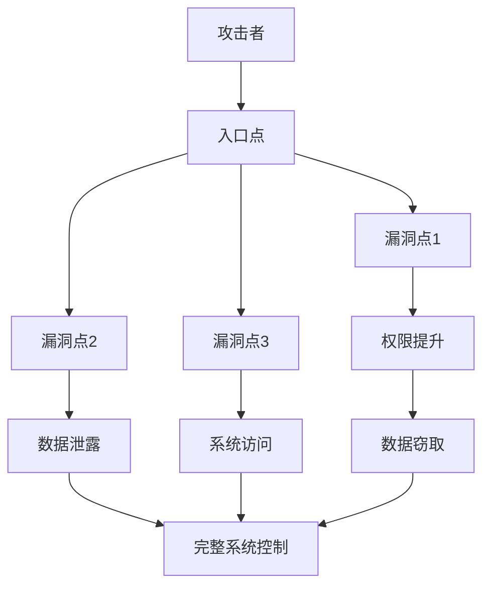

# 架构分析知识

## 一、架构分析的核心思想

架构分析是Phase 1的核心任务，目的是从系统架构层面评估安全风险，识别单个代码层面很难发现的系统性安全问题。

## 二、架构类型

### 2.1 分层架构

**定义**：将系统分为多个层次，每层负责不同的功能

**常见分层**
- 表现层：API接口、前端应用、入口点
- 业务层：服务逻辑、业务规则、权限控制
- 数据层：数据库、缓存、文件存储
- 基础设施层：中间件、容器、云服务

**分析方法**
- 识别每层的组件
- 分析层间的关系
- 评估层间的安全边界
- 检查层间的通信安全

### 2.2 微服务架构

**定义**：将系统拆分为多个独立的服务，每个服务负责特定的业务功能

**常见组件**
- API网关：统一入口、路由、认证、限流
- 服务发现：服务注册、健康检查
- 配置中心：统一配置管理
- 消息队列：异步通信、事件驱动
- 监控系统：日志、指标、告警

**分析方法**
- 识别服务间的通信方式
- 分析服务间的认证和授权
- 评估服务间的数据传输安全
- 检查服务间的依赖关系

### 2.3 事件驱动架构

**定义**：通过事件驱动系统行为，组件间通过事件通信

**常见组件**
- 事件总线：事件发布、订阅、路由
- 事件存储：事件持久化、重放
- 事件处理器：业务逻辑处理
- 事件溯源：事件追踪、审计

**分析方法**
- 识别事件的发布和订阅关系
- 分析事件的格式和内容
- 评估事件传输的安全性
- 检查事件处理的权限控制

## 三、安全架构评估

### 3.1 网络安全

**评估项**
- 网络隔离：不同安全级别系统是否隔离
- 防火墙配置：入站出站规则是否合理
- DMZ区域：外部可访问服务是否隔离
- 内部网络分段：减少攻击面
- 网络加密：网络传输是否加密
- 网络监控：网络流量监控和异常检测

**常见问题**
- 未隔离的内部网络
- 过于宽松的防火墙规则
- 缺少网络加密
- 缺少网络监控

### 3.2 数据安全

**评估项**
- 数据分类：敏感数据是否识别和保护
- 加密策略：传输和存储是否加密
- 数据脱敏：非生产环境数据处理
- 备份安全：备份数据加密和访问控制
- 数据销毁：安全的数据销毁策略
- 数据访问审计：数据访问审计和监控

**常见问题**
- 未加密的敏感数据
- 缺少数据分类
- 备份数据未加密
- 缺少数据访问审计

### 3.3 身份与访问管理

**评估项**
- 集中认证：统一身份管理
- 授权策略：基于角色的访问控制
- 特权访问管理：管理员权限控制
- 身份验证强度：多因素认证
- 身份生命周期管理：用户身份生命周期管理
- 访问控制审计：访问控制审计和监控

**常见问题**
- 缺少集中认证
- 过于宽松的权限设置
- 缺少多因素认证
- 缺少访问审计

### 3.4 应用架构安全

**评估项**
- 分层架构：清晰的责任分离
- 微服务安全：服务间通信加密和认证
- API网关：集中的API安全控制
- 容器安全：容器镜像扫描和运行时安全
- 无服务器安全：无服务器架构的安全配置

**常见问题**
- 职责不清晰
- 服务间通信未加密
- 缺少API网关
- 容器配置不安全

### 3.5 业务逻辑安全

**评估项**
- 业务规则验证：服务端业务逻辑校验
- 交易安全：金额和操作限制
- 敏感操作：二次确认机制
- 业务流程：状态转换安全
- 业务逻辑漏洞：业务逻辑中的安全漏洞
- 业务连续性：业务连续性和灾难恢复

**常见问题**
- 仅客户端验证
- 缺少业务规则验证
- 缺少敏感操作确认
- 状态转换不安全

## 四、架构分析方法

### 4.1 静态分析

**方法**：通过架构文档和配置文件分析

**步骤**
1. 收集架构文档
2. 分析架构图和设计文档
3. 评估配置文件的安全性
4. 识别架构层面的安全风险

### 4.2 动态分析

**方法**：通过运行时监控和测试

**步骤**
1. 部署监控工具
2. 收集运行时数据
3. 分析系统行为
4. 识别架构层面的安全问题

### 4.3 混合分析

**方法**：结合静态和动态分析

**步骤**
1. 静态分析识别潜在风险
2. 动态分析验证风险真实性
3. 结合分析结果评估整体风险
4. 提供架构层面的安全建议

## 五、架构可视化

### 5.1 架构图

**类型**
- 系统架构图：展示系统整体架构
- 网络架构图：展示网络拓扑
- 数据流图：展示数据流向
- 部署架构图：展示部署方式

**要素**
- 核心组件：所有关键服务、数据库、中间件
- 数据流：主要数据传输路径、方向、格式
- 安全边界：网络隔离、权限边界、加密区域
- 外部依赖：第三方服务、API、云资源
- 潜在风险点：标记可能的攻击入口、敏感操作

### 5.2 Mermaid建模

**业务流程图**

**数据流图**

**攻击路径图**

## 六、架构风险评估

### 6.1 风险识别

**系统性风险**
- 单点故障：关键服务无冗余
- 安全边界缺失：网络隔离不足
- 权限模型缺陷：过于宽松的权限设置
- 加密策略不当：敏感数据未加密

**架构缺陷**
- 缺少防御纵深：单一安全控制
- 缺少最小权限：过度授权
- 缺少安全默认：不安全的默认配置
- 缺少可观测性：缺少安全监控

### 6.2 风险评估

**评估维度**
- 安全性：认证、授权、加密、审计
- 可靠性：容错、备份、恢复
- 性能：scalability、响应时间、资源使用
- 可维护性：代码质量、文档、监控

**风险等级**
- Critical：可能导致系统完全被控制
- High：可能导致敏感数据泄露
- Medium：可能导致部分功能受影响
- Low：影响有限，容易修复

### 6.3 风险优先级

**优先级原则**
- 认证漏洞优先：认证绕过是根漏洞
- 公共工具优先：公共工具类的风险影响大
- 攻击面导向：根据技术栈调整审计重点
- 业务价值关联：优先审计核心业务逻辑

## 七、架构改进建议

### 7.1 防御纵深

**建议**
- 实施多层安全控制
- 部署入侵检测系统
- 配置网络分段和隔离
- 实施端点保护

### 7.2 最小权限

**建议**
- 按需分配权限
- 实施细粒度的访问控制
- 定期审查权限
- 移除未使用的权限

### 7.3 安全默认

**建议**
- 使用安全的默认配置
- 禁用不必要的服务和端口
- 启用安全选项
- 定期更新配置

### 7.4 可观测性

**建议**
- 实施安全监控
- 配置日志收集和分析
- 设置安全告警
- 建立安全事件响应机制

## 八、最佳实践

### 8.1 架构设计

- 安全第一：从设计阶段考虑安全
- 最小权限：遵循最小权限原则
- 防御纵深：实施多层安全控制
- 失效安全：设计安全的失效机制

### 8.2 架构实施

- 安全配置：使用安全的配置
- 安全部署：使用安全的部署方式
- 安全监控：实施安全监控和告警
- 安全维护：定期更新和维护

### 8.3 架构审计

- 定期审计：定期进行架构安全审计
- 持续改进：基于审计结果持续改进
- 知识积累：积累架构安全知识
- 最佳实践分享：分享架构安全最佳实践