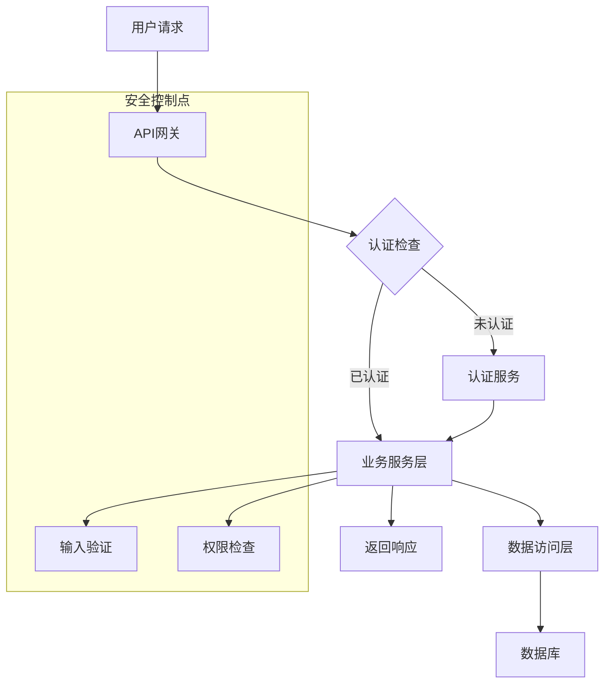
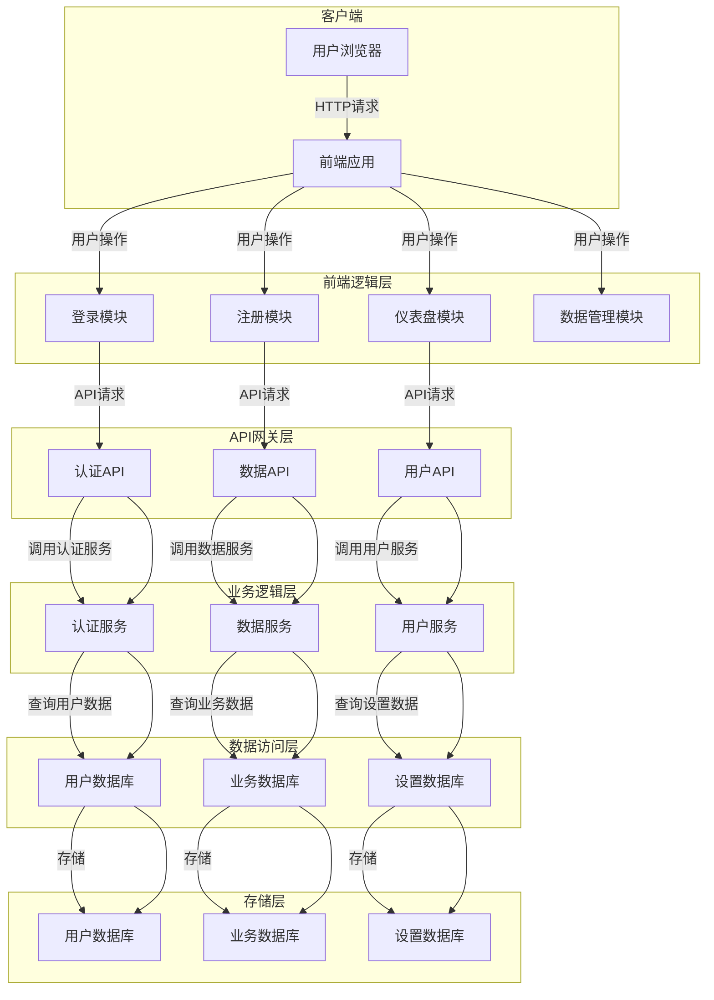
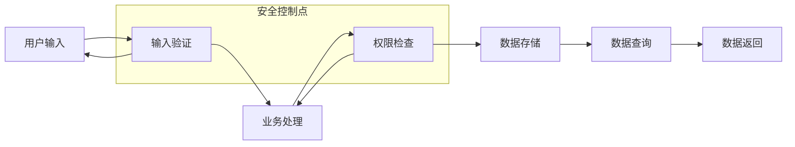
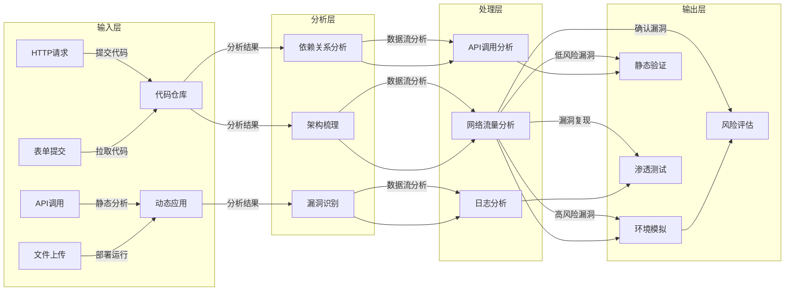
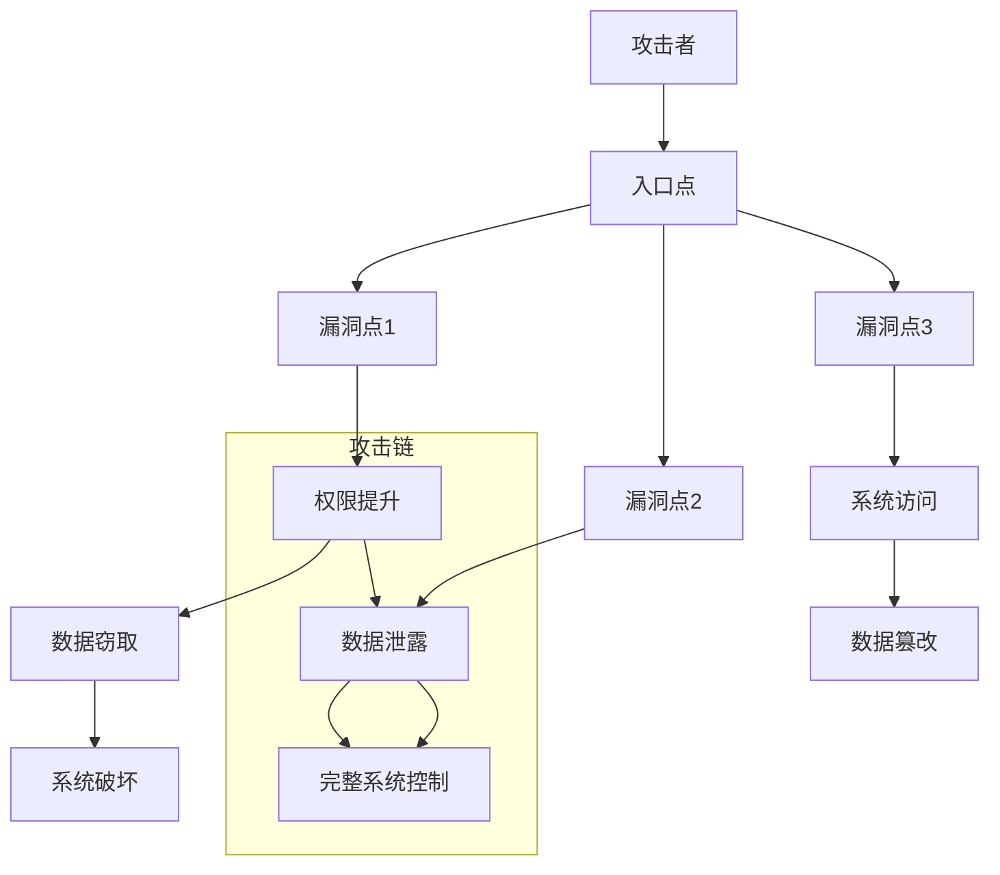
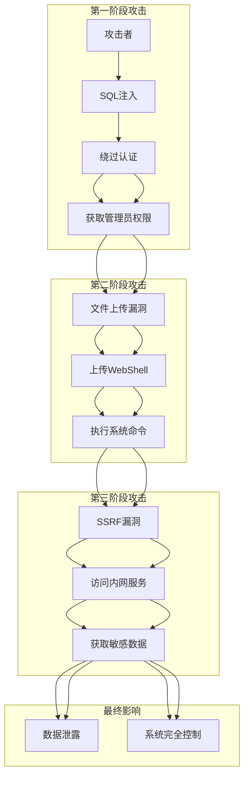
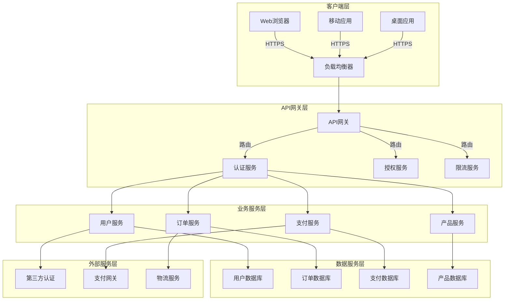
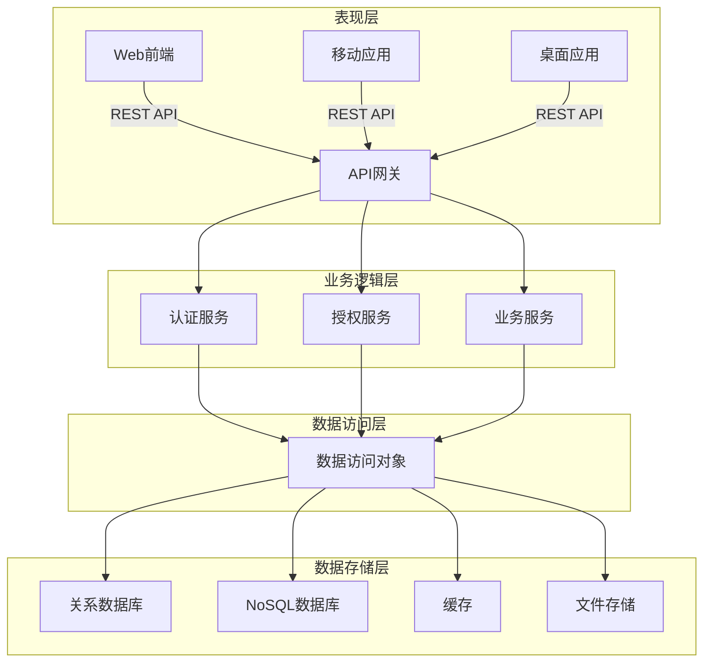

# 架构图模板

基于SKILL.md Mermaid建模规范的架构图模板

## 1. 业务流程图模板

### 1.1 基本业务流程图

### 1.2 复杂业务流程图

## 2. 数据流图模板

### 2.1 基本数据流图

### 2.2 复杂数据流图

## 3. 攻击路径图模板

### 3.1 基本攻击路径图

### 3.2 复杂攻击路径图

## 4. 架构组件关系图模板

### 4.1 微服务架构图

### 4.2 分层架构图

## 5. 使用说明

### 5.1 节点样式
- **Source（数据输入点）**：使用蓝色填充，蓝色边框
- **Filter（安全控制点）**：使用青色填充，青色边框
- **Service（业务处理点）**：使用绿色填充，绿色边框
- **Sink（数据输出点）**：使用红色填充，红色边框
- **Risk（风险点）**：使用黄色填充，黄色边框

### 5.2 连接线样式
- **数据流**：使用实线，箭头表示数据流向
- **攻击路径**：使用虚线，箭头表示攻击路径
- **依赖关系**：使用点线，表示组件依赖

### 5.3 子图使用
- 使用 `subgraph` 关键字创建逻辑分组
- 为每个子图添加描述性标签
- 使用不同的颜色区分不同层级

### 5.4 最佳实践
1. **保持简洁**：避免过度复杂的图表
2. **使用标准符号**：使用Mermaid标准符号
3. **添加注释**：为关键节点添加注释说明
4. **颜色一致性**：在整个图表中保持颜色方案一致
5. **可读性优先**：确保图表易于理解