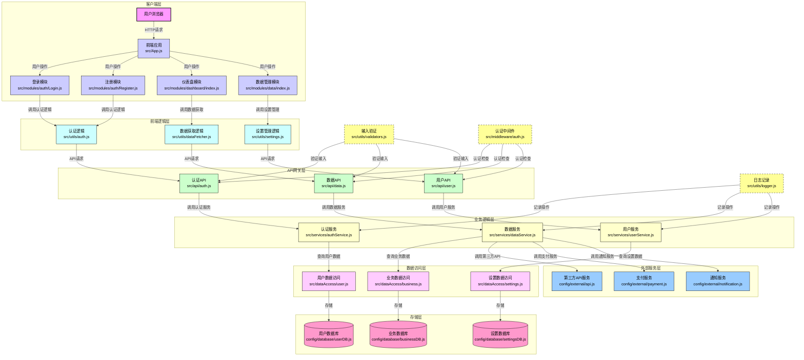
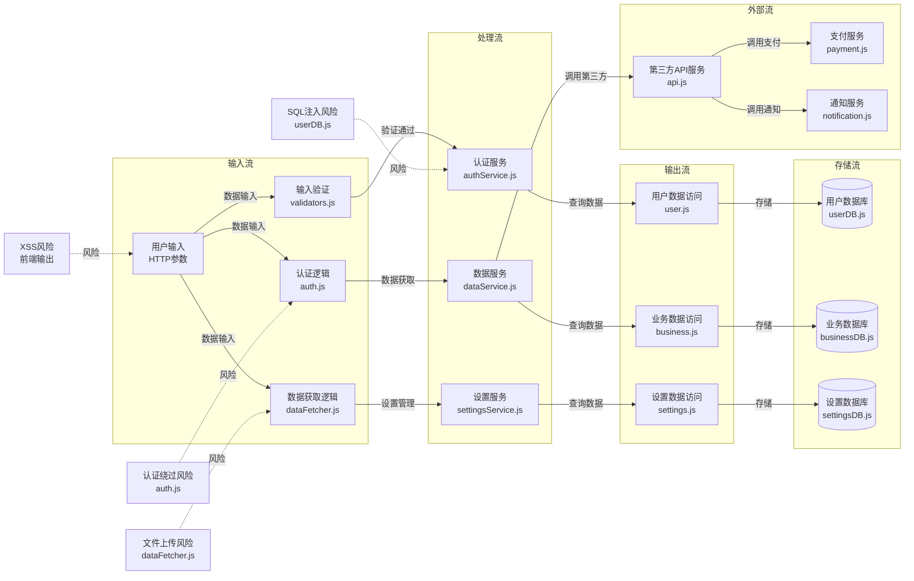
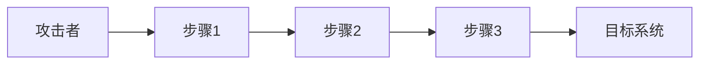
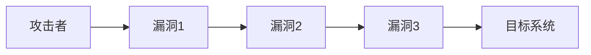

# Web应用安全审计报告模板

> 版本: 2.0.0  
> 支持两种模式：快速版（简洁）和完整版（详细）

---

## 使用说明

本模板提供两种报告模式：

- **快速版**：适合日常审计、CI/CD集成，包含核心漏洞信息和修复建议
- **完整版**：适合深度审计、渗透测试准备，包含详细的攻击链分析和测试验证

根据审计深度选择合适的章节填写。

---

# 快速版报告

## 1. 执行摘要

### 1.1 项目基本信息

| 属性 | 值 |
|------|-----|
| **项目名称** | [项目名称] |
| **技术栈** | [语言/框架/数据库] |
| **审计日期** | [日期] |
| **审计范围** | [范围] |
| **审计方法** | 白盒代码审计 |

### 1.2 关键发现统计

| 风险等级 | 数量 | 主要类型 |
|---------|------|---------|
| 🔴 Critical | [数量] | [类型] |
| 🟠 High | [数量] | [类型] |
| 🟡 Medium | [数量] | [类型] |
| 🟢 Low | [数量] | [类型] |

### 1.3 整体风险评估

**综合风险等级**: [Critical/High/Medium/Low]

**主要风险**: [一句话总结]

**建议措施**: [一句话建议]

---

## 2. 漏洞详情（快速版）

### VULN-[编号]: [漏洞名称] ([风险等级])

#### 基本信息
| 属性 | 值 |
|------|-----|
| **漏洞类型** | [类型] |
| **CVSS 3.1** | [分数] ([等级]) |
| **CWE** | [编号] |
| **位置** | [文件:行号] |
| **维度** | [D1-D10] |

#### 漏洞代码
```[语言]
[存在漏洞的代码片段]
```

#### 攻击场景
1. [攻击步骤1]
2. [攻击步骤2]
3. [攻击步骤3]

#### 修复建议
```[语言]
[修复后的代码]
```

**修复说明**: [说明]

---

## 3. 修复优先级（快速版）

### 立即修复（24小时内）
- [ ] [漏洞1]
- [ ] [漏洞2]

### 短期修复（1周内）
- [ ] [漏洞3]
- [ ] [漏洞4]

### 中期修复（1月内）
- [ ] [漏洞5]
- [ ] [漏洞6]

---

*快速版报告结束。如需详细分析，请继续阅读完整版。*

---

---

# 完整版报告

## 1. 项目概述

### 1.1 项目基本信息

**项目名称**：[项目名称]  
**技术栈**：
- 语言：[语言]
- 框架：[框架]
- 数据库：[数据库]
- 依赖管理：[工具]

**安全审计日期**：[审计日期]  
**审计范围**：[审计范围]  
**审计方法**：白盒代码审计（深度污点追踪 + 模式匹配 + 实际测试验证）  
**发现漏洞**：[数量]个（[高危]个，[中危]个，[低危]个）  
**CVSS 综合评分**：[评分] ([等级]）

### 1.2 项目架构图



### 1.3 数据流图



### 1.4 安全风险概览

| 风险等级 | 漏洞数量 | 主要漏洞类型 |
|---------|---------|------------|
| 🔴 Critical | [数量] | [类型] |
| 🟠 High | [数量] | [类型] |
| 🟡 Medium | [数量] | [类型] |
| 🟢 Low | [数量] | [类型] |

---

## 2. 安全机制分析

### 2.1 现有安全措施

| 安全措施 | 实现位置 | 描述 | 评估 |
|---------|---------|------|------|
| [措施 1] | [位置] | [描述] | [有效/需改进/缺失] |
| [措施 2] | [位置] | [描述] | [有效/需改进/缺失] |

### 2.2 安全机制评估

**优点**：
1. [优点 1]
2. [优点 2]
3. [优点 3]

**不足**：
1. [不足 1]
2. [不足 2]
3. [不足 3]

---

## 3. 漏洞详情（完整版）

### VULN-[编号]: [漏洞名称]

#### 3.1 基本信息

| 属性 | 值 |
|------|-----|
| **漏洞 ID** | [ID] |
| **漏洞类型** | [类型] |
| **风险等级** | [Critical/High/Medium/Low] |
| **CVSS 3.1** | [分数] ([等级]) |
| **CWE** | [编号] |
| **对应维度** | [D1-D10] |
| **文件位置** | [路径] |
| **影响行数** | [行号范围] |

#### 3.2 漏洞描述

[详细描述漏洞原理、危害和利用条件]

#### 3.3 漏洞代码

```[语言]
[存在漏洞的代码片段，包含上下文]
```

#### 3.4 数据流分析

```
Source: [用户输入点]
    ↓
Filter: [输入验证/过滤]
    ↓
Service: [业务逻辑处理]
    ↓
Sink: [危险操作点]
```

**详细路径**：
1. [步骤1]
2. [步骤2]
3. [步骤3]

#### 3.5 攻击链分析



#### 3.6 实际测试验证

**测试环境**：
- [环境配置]

**测试载荷**：
```
[测试载荷]
```

**预期结果**：[预期结果]  
**实际结果**：[实际结果]  
**测试状态**：[通过/失败]

#### 3.7 误报检测

**多层防护检查**：
1. [检查 1]: [结果]
2. [检查 2]: [结果]
3. [检查 3]: [结果]

**结论**：[确认漏洞 / 潜在风险 / 误报]

#### 3.8 修复建议

**方案 1（推荐）**：[方案说明]
```[语言]
[修复后的代码]
```

**方案 2（备选）**：[方案说明]
```[语言]
[修复后的代码]
```

**修复验证**：
```bash
[验证命令]
```

---

## 4. 攻击链综合分析

### 4.1 攻击链 A: [名称]

#### 涉及漏洞
| 序号 | 漏洞ID | 作用 |
|------|--------|------|
| 1 | VULN-XXX | [作用] |
| 2 | VULN-XXX | [作用] |

#### 攻击路径


#### 综合风险评估
- **独立风险**：各漏洞单独的风险等级
- **组合风险**：漏洞组合后的综合风险
- **修复优先级**：建议的修复顺序

---

## 5. 架构层面风险

### 5.1 数据流风险

| 风险点 | 位置 | 描述 | 风险等级 |
|-------|------|------|---------|
| [风险1] | [位置] | [描述] | [等级] |

### 5.2 业务流风险

| 风险点 | 位置 | 描述 | 风险等级 |
|-------|------|------|---------|
| [风险1] | [位置] | [描述] | [等级] |

### 5.3 网络安全架构风险

| 风险点 | 位置 | 描述 | 风险等级 |
|-------|------|------|---------|
| [风险1] | [位置] | [描述] | [等级] |

---

## 6. 修复建议汇总

### 6.1 立即修复（P0 - 24小时内）

| 优先级 | 漏洞ID | 漏洞名称 | 预计修复时间 |
|-------|--------|---------|------------|
| P0 | VULN-001 | [名称] | [时间] |
| P0 | VULN-002 | [名称] | [时间] |

### 6.2 短期修复（P1 - 1周内）

| 优先级 | 漏洞ID | 漏洞名称 | 预计修复时间 |
|-------|--------|---------|------------|
| P1 | VULN-003 | [名称] | [时间] |

### 6.3 中期修复（P2 - 1月内）

| 优先级 | 漏洞ID | 漏洞名称 | 预计修复时间 |
|-------|--------|---------|------------|
| P2 | VULN-004 | [名称] | [时间] |

### 6.4 长期改进（P3 - 3月内）

| 优先级 | 改进项 | 描述 |
|-------|--------|------|
| P3 | [改进项] | [描述] |

---

## 7. 安全改进计划

### 7.1 短期措施（1个月内）

1. [措施1]
2. [措施2]
3. [措施3]

### 7.2 中期措施（3个月内）

1. [措施1]
2. [措施2]
3. [措施3]

### 7.3 长期措施（6个月内）

1. [措施1]
2. [措施2]
3. [措施3]

---

## 8. 覆盖矩阵检查

| # | 维度 | 已覆盖? | 发现数 | 覆盖率 |
|---|------|---------|--------|--------|
| D1 | 注入 | [ ] | | |
| D2 | 认证 | [ ] | | |
| D3 | 授权 | [ ] | | |
| D4 | 反序列化 | [ ] | | |
| D5 | 文件操作 | [ ] | | |
| D6 | SSRF | [ ] | | |
| D7 | 加密 | [ ] | | |
| D8 | 配置 | [ ] | | |
| D9 | 业务逻辑 | [ ] | | |
| D10 | 供应链 | [ ] | | |

---

## 9. 总结

### 9.1 审计结论

[总体结论]

### 9.2 关键发现

| 发现 | 描述 |
|------|------|
| [发现 1] | [描述] |
| [发现 2] | [描述] |

### 9.3 安全态势评估

- **整体安全状态**：[高/中/低风险]
- **主要风险**：[主要风险描述]
- **风险分布**：[风险分布情况]

---

## 附录

### A. 参考文档

- [OWASP Top 10](https://owasp.org/www-project-top-ten)
- [OWASP ASVS](https://owasp.org/www-project-application-security-verification-standard)
- [CWE Top 25](https://cwe.mitre.org/top25)

### B. 测试环境

- PHP 版本：[版本]
- 操作系统：[操作系统]
- 测试工具：[工具]
- 测试页面：[URL]

### C. 联系方式

**审计团队**：dfyx_code_security_review  
**审计日期**：[日期]  
**报告版本**：[版本]

---

*本报告仅用于安全审计目的，未经授权不得用于其他用途。*
