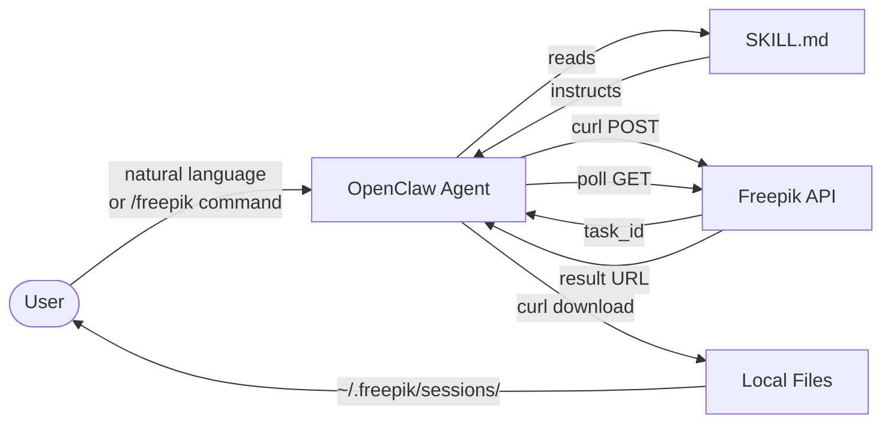
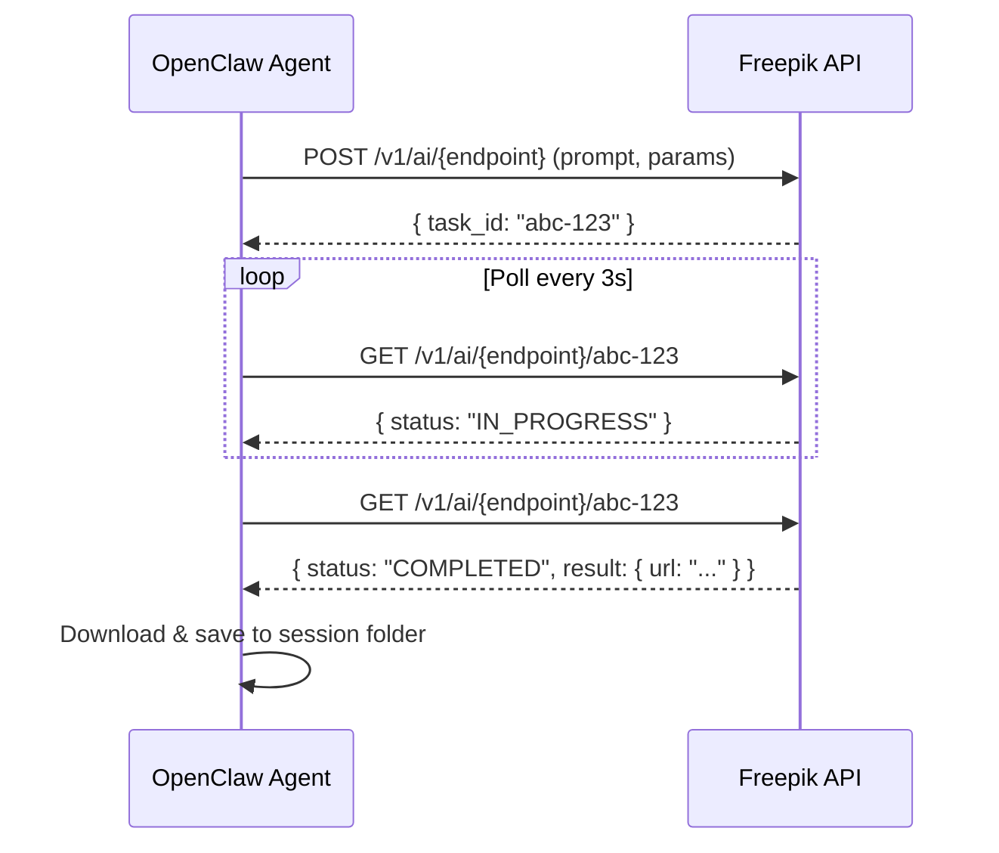

# freepik-skill


An [OpenClaw](https://openclaw.ai) skill for the [Freepik API](https://www.freepik.com/api) — image generation, video generation, image editing, icon generation, audio, stock content, and AI utilities.

Built and maintained by the [ShellBot](https://getshell.ai) team for use with OpenClaw hosted instances.

> **Free credits:** Register at [freepik.com](https://www.freepik.com/) and get **$5 USD in free API credits** to start generating right away — no credit card required.

## Installation

### From ClawHub (recommended)

```bash
clawhub install freepik
```

### Manual

```bash
git clone https://github.com/SqaaSSL/freepik-openclaw-skill ~/.openclaw/skills/freepik
```

## Setup

1. Get an API key from [Freepik Developers Dashboard](https://www.freepik.com/developers/dashboard)

2. Add to your shell config (`~/.zshrc` or `~/.bashrc`):
   ```bash
   export FREEPIK_API_KEY="your-key-here"
   ```

3. Reload your shell:
   ```bash
   source ~/.zshrc
   ```

## Architecture

### How the Skill Works



### Async Task Lifecycle



## Usage

### Commands

| Command | Description |
|---------|-------------|
| `/freepik generate <model> --prompt "..."` | Generate images (Mystic, Flux, Seedream, etc.) |
| `/freepik video <model> --prompt "..."` | Generate videos (Kling, Hailuo, WAN, RunWay, etc.) |
| `/freepik edit <operation> --image "..."` | Edit images (upscale, restyle, relight, expand, etc.) |
| `/freepik icon --prompt "..."` | Generate icons in PNG or SVG |
| `/freepik audio <type> --prompt "..."` | Generate music, sound effects, or voiceover |
| `/freepik stock <type> --query "..."` | Search stock photos, vectors, icons, videos |
| `/freepik status <task-id>` | Check async task status |
| `/freepik utility <tool>` | AI classifier, image-to-prompt, improve prompt, lip sync |

### Examples

```bash
# Generate an image with Mystic (Freepik's flagship model)
/freepik generate mystic --prompt "a futuristic cityscape at sunset"

# Generate a video with Kling 3 Omni
/freepik video kling-v3-omni-pro --prompt "ocean waves crashing on rocks"

# Upscale an image 4x with Magnific
/freepik edit upscale-creative --image "./photo.jpg" --scale 4

# Generate an icon
/freepik icon --prompt "shopping cart" --style outline --format svg

# Generate background music
/freepik audio music --prompt "upbeat electronic" --duration 30

# Search stock photos
/freepik stock images --query "business meeting"
```

Or just ask naturally:

> "Generate a 4K image of a mountain landscape using Freepik"

> "Create a 10 second video of a cat playing"

> "Make me a flat icon of a rocket ship in SVG"

> "Upscale this image to 4x resolution"

## API Categories

| Category | Models/Features |
|----------|----------------|
| Image Generation | Mystic (exclusive), Flux (Kontext Pro, 2 Pro, 2 Turbo, 2 Klein, Dev, HyperFlux), Seedream (4.5, 4), Z-Image, RunWay Gen4 |
| Video Generation | Kling (3 Omni, 3, 2.6, 2.5, 2.1, O1, Elements), Hailuo (02, 2.3, Live), WAN (2.6, 2.5, 2.2), RunWay (Gen 4.5, Gen4 Turbo, Act Two), LTX 2.0, Seedance (1.5, Pro, Lite), PixVerse V5, OmniHuman 1.5, VFX Effects |
| Image Editing | Upscaler (Creative, Precision V1/V2), Relight, Style Transfer, Remove Background, Image Expand (Flux/Ideogram/Seedream), Inpainting (Ideogram), Change Camera, Skin Enhancer |
| Icons | AI Icon Generation (PNG/SVG, 5 styles) |
| Audio | Music Generation, Sound Effects, Audio Isolation, Voiceover (ElevenLabs) |
| Stock Content | Photos, Vectors, PSDs, Icons, Videos |
| AI Utilities | Image Classifier, Image-to-Prompt, Improve Prompt, Lip Sync |

See [models-reference.md](models-reference.md) for the complete model catalog with parameters.

## How It Works

This skill teaches an OpenClaw agent how to interact with Freepik's REST API using curl. Most endpoints are async (queue-based):

1. POST request submits a task and returns a `task_id`
2. Poll the GET endpoint until `status: "COMPLETED"`
3. Download results to your machine

Some endpoints (Remove Background, AI Classifier) are synchronous.

## Links

- [Freepik API Docs](https://docs.freepik.com) - Full API documentation
- [Freepik Developers Dashboard](https://www.freepik.com/developers/dashboard) - API keys and usage
- [ShellBot](https://getshell.ai) - OpenClaw Secure hosted service
- [OpenClaw Skills Docs](https://docs.openclaw.ai/tools/skills) - Learn about skills

## License

[MIT](LICENSE)
