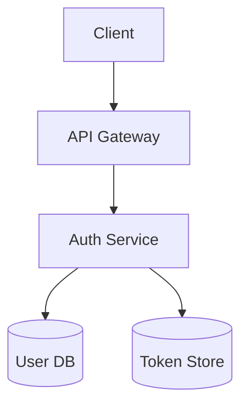
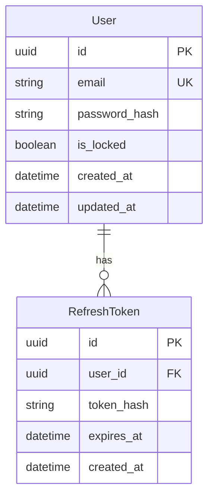

# Example: User Authentication Feature

This example demonstrates a complete spec for adding user authentication.

---

## Proposal (proposal.md)

```markdown
# User Authentication - Proposal

> **Status**: Approved
> **Author**: Alice Chen
> **Created**: 2024-01-10
> **Last Updated**: 2024-01-12

## Background

Currently, our application has no user authentication. All features are
publicly accessible. As we add user-specific features (saved preferences,
personal data), we need a way to identify and authenticate users.

## Goals

- [ ] Users can create accounts with email/password
- [ ] Users can log in and maintain sessions
- [ ] Protected routes require authentication
- [ ] Sessions persist across browser restarts

## Non-Goals

- Social login (Google, GitHub) - future iteration
- Two-factor authentication - future iteration
- Password-less login - not planned
- Enterprise SSO - separate project

## Scope

### In Scope

- User registration with email/password
- Login/logout functionality
- Session management with JWT
- Password reset via email
- Protected route middleware

### Out of Scope

- User profile management
- Role-based access control
- Admin user management

## Risks and Mitigations

| Risk | Likelihood | Impact | Mitigation |
|------|------------|--------|------------|
| Security vulnerabilities | Medium | High | Use battle-tested libraries, security review |
| Password data breach | Low | High | Bcrypt hashing, secure storage |
| Session hijacking | Low | Medium | HTTP-only cookies, short expiry |

## Open Questions

- [x] Which JWT library? → Resolved: jose
- [x] Session duration? → Resolved: 7 days, refresh on activity
```

---

## Requirements (requirements.md)

```markdown
# User Authentication - Requirements

> **Status**: Approved
> **Proposal**: [proposal.md](./proposal.md)

## Functional Requirements

### Registration

- **FR-001**: When a user submits the registration form with valid email and
  password, the system shall create a new user account.
- **FR-002**: When registration email already exists, the system shall reject
  with error code EMAIL_EXISTS.
- **FR-003**: The system shall validate passwords have minimum 8 characters,
  1 uppercase, 1 lowercase, and 1 number.

### Login

- **FR-010**: When a user submits valid credentials, the system shall return
  a JWT access token and set HTTP-only refresh cookie.
- **FR-011**: When credentials are invalid, the system shall return 401 with
  error code INVALID_CREDENTIALS.
- **FR-012**: If account is locked, then the system shall NOT authenticate
  and return error code ACCOUNT_LOCKED.

### Session

- **FR-020**: While user has valid session, the system shall include user ID
  in request context.
- **FR-021**: When access token expires but refresh token is valid, the
  system shall issue new access token automatically.

### Logout

- **FR-030**: When user requests logout, the system shall invalidate the
  refresh token and clear cookies.

## Non-Functional Requirements

### Performance

- **NFR-001**: The login endpoint shall respond within 500ms for p99.
- **NFR-002**: Token validation shall complete within 10ms.

### Security

- **NFR-010**: The system shall hash passwords with bcrypt cost factor 12.
- **NFR-011**: The system shall NOT log passwords or tokens in any logs.
- **NFR-012**: Access tokens shall expire after 15 minutes.
- **NFR-013**: Refresh tokens shall expire after 7 days.

## Acceptance Criteria

- [ ] **AC-001**: Given valid email/password, when registering, then account
  is created and user can log in.
- [ ] **AC-002**: Given existing email, when registering, then receive 409
  with EMAIL_EXISTS error.
- [ ] **AC-010**: Given valid credentials, when logging in, then receive JWT
  and can access protected routes.
- [ ] **AC-011**: Given invalid credentials, when logging in, then receive
  401 error.
- [ ] **AC-020**: Given expired access token with valid refresh, when
  accessing protected route, then token refreshes automatically.
```

---

## Design (design.md)

```markdown
# User Authentication - Design

> **Status**: Approved
> **Requirements**: [requirements.md](./requirements.md)

## Architecture Overview



## API Design

### POST /api/auth/register

**Request**:
```json
{
  "email": "user@example.com",
  "password": "SecurePass123"
}
```

**Response (201)**:
```json
{
  "user": { "id": "uuid", "email": "user@example.com" },
  "accessToken": "jwt..."
}
```

### POST /api/auth/login

**Request**:
```json
{
  "email": "user@example.com",
  "password": "SecurePass123"
}
```

**Response (200)**:
```json
{
  "user": { "id": "uuid", "email": "user@example.com" },
  "accessToken": "jwt..."
}
```
+ Set-Cookie: refreshToken=...; HttpOnly; Secure

### POST /api/auth/logout

**Response (200)**: Empty + Clear-Cookie

## Data Model



## Error Codes

| Code | HTTP | Description |
|------|------|-------------|
| EMAIL_EXISTS | 409 | Email already registered |
| INVALID_CREDENTIALS | 401 | Wrong email or password |
| ACCOUNT_LOCKED | 403 | Account is locked |
| TOKEN_EXPIRED | 401 | Token has expired |
| INVALID_TOKEN | 401 | Token is malformed |
```

---

## Tasks (tasks.md)

```markdown
# User Authentication - Tasks

> **Status**: In Progress
> **Started**: 2024-01-15
> **Target**: 2024-01-22

## Summary

| Phase | Tasks | Completed | Progress |
|-------|-------|-----------|----------|
| Setup | 3 | 3 | 100% |
| Implementation | 5 | 2 | 40% |
| Testing | 3 | 0 | 0% |
| Documentation | 2 | 0 | 0% |
| **Total** | **13** | **5** | **38%** |

## Task Breakdown

### Phase 1: Setup

- [x] **T-001**: Add auth dependencies (bcrypt, jose)
  - Complexity: Low
  - Files: package.json
  - Dependencies: None

- [x] **T-002**: Create User model and migration
  - Complexity: Medium
  - Files: src/models/user.ts, migrations/
  - Dependencies: T-001

- [x] **T-003**: Create RefreshToken model
  - Complexity: Low
  - Files: src/models/refreshToken.ts
  - Dependencies: T-002

### Phase 2: Implementation

- [x] **T-010**: Implement password hashing service
  - Complexity: Low
  - Files: src/services/passwordService.ts
  - Dependencies: T-001

- [x] **T-011**: Implement JWT service
  - Complexity: Medium
  - Files: src/services/tokenService.ts
  - Dependencies: T-001

- [ ] **T-012**: Implement auth service (register/login/logout)
  - Complexity: High
  - Files: src/services/authService.ts
  - Dependencies: T-010, T-011
  - **Status**: 🔄 In Progress

- [ ] **T-013**: Implement auth routes
  - Complexity: Medium
  - Files: src/routes/auth.ts
  - Dependencies: T-012

- [ ] **T-014**: Implement auth middleware
  - Complexity: Medium
  - Files: src/middleware/auth.ts
  - Dependencies: T-011

### Phase 3: Testing

- [ ] **T-030**: Unit tests for services
  - Complexity: Medium
  - Files: tests/unit/auth/
  - Dependencies: T-012

- [ ] **T-031**: Integration tests for auth flow
  - Complexity: Medium
  - Files: tests/integration/auth.test.ts
  - Dependencies: T-013, T-014

- [ ] **T-032**: Security testing
  - Complexity: High
  - Files: tests/security/auth.test.ts
  - Dependencies: T-031

### Phase 4: Documentation

- [ ] **T-040**: API documentation
  - Complexity: Low
  - Files: docs/api/auth.md
  - Dependencies: T-013

- [ ] **T-041**: Update security docs
  - Complexity: Low
  - Files: docs/security.md
  - Dependencies: T-032

## Progress Tracking

| Task | Status | Started | Completed |
|------|--------|---------|-----------|
| T-001 | ✅ Done | 2024-01-15 | 2024-01-15 |
| T-002 | ✅ Done | 2024-01-15 | 2024-01-15 |
| T-003 | ✅ Done | 2024-01-15 | 2024-01-15 |
| T-010 | ✅ Done | 2024-01-16 | 2024-01-16 |
| T-011 | ✅ Done | 2024-01-16 | 2024-01-16 |
| T-012 | 🔄 In Progress | 2024-01-17 | |
| T-013 | ⏳ Pending | | |
| T-014 | ⏳ Pending | | |
| T-030 | ⏳ Pending | | |
| T-031 | ⏳ Pending | | |
| T-032 | ⏳ Pending | | |
| T-040 | ⏳ Pending | | |
| T-041 | ⏳ Pending | | |
```

---

This example demonstrates:

1. **Clear progression** from proposal → requirements → design → tasks
2. **Traceability** between documents (links, requirement IDs)
3. **EARS format** for requirements
4. **Mermaid diagrams** for visual design
5. **Task tracking** with status and progress
