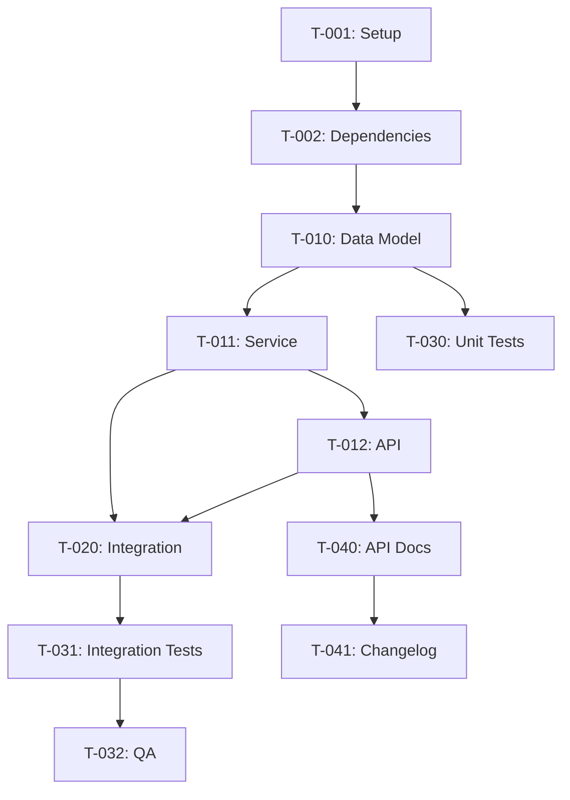

# Task Decomposition Best Practices

This guide covers how to break down work into effective, executable tasks.

## Why Decompose Tasks?

1. **Clarity**: Each task has a single, clear objective
2. **Progress Tracking**: Visible progress motivates and informs
3. **Parallelization**: Independent tasks can be done concurrently
4. **Risk Management**: Smaller tasks fail faster, recover easier
5. **AI Compatibility**: Smaller tasks are easier for AI agents to execute

## The INVEST Criteria

Good tasks follow INVEST:

| Criteria | Description | Example |
|----------|-------------|---------|
| **I**ndependent | Minimize dependencies | "Add User model" not "Add all models" |
| **N**egotiable | Details can be discussed | "Display user info" vs "Use Card component at 320px" |
| **V**aluable | Delivers value | "Add login endpoint" not "Rename internal variable" |
| **E**stimable | Can estimate effort | "Add form validation" not "Improve UX" |
| **S**mall | Completable quickly | "Add name field" not "Build entire form" |
| **T**estable | Has verification | "Returns 200 with user data" |

## Task Size Guidelines

### Ideal Task Size

- **Time**: 15-60 minutes of focused work
- **Tool Calls**: 1-3 tool invocations
- **Changes**: 1-3 files modified
- **Complexity**: Single concept or change

### Signs Task is Too Large

- ❌ Estimate says "High" complexity
- ❌ Affects 5+ files
- ❌ Contains "and" in description
- ❌ Multiple acceptance criteria
- ❌ Can't explain in one sentence

### Signs Task is Too Small

- ❌ Takes <5 minutes
- ❌ Just renaming/moving
- ❌ No testable outcome
- ❌ Could be combined with related task

## Task Phases

Organize tasks into logical phases:

### Phase 1: Setup

Foundation work that enables other tasks.

```
T-001: Create directory structure
  - Complexity: Low
  - Files: N/A (new directories)
  - Dependencies: None

T-002: Add required dependencies
  - Complexity: Low
  - Files: package.json
  - Dependencies: T-001

T-003: Configure environment
  - Complexity: Low
  - Files: .env.example, config.ts
  - Dependencies: T-002
```

### Phase 2: Core Implementation

Main feature development.

```
T-010: Implement data model
  - Complexity: Medium
  - Files: src/models/user.ts
  - Dependencies: T-002

T-011: Implement service layer
  - Complexity: Medium
  - Files: src/services/userService.ts
  - Dependencies: T-010

T-012: Implement API endpoints
  - Complexity: Medium
  - Files: src/routes/users.ts
  - Dependencies: T-011
```

### Phase 3: Integration

Connecting components together.

```
T-020: Wire service to routes
  - Complexity: Low
  - Files: src/app.ts
  - Dependencies: T-011, T-012

T-021: Add middleware
  - Complexity: Medium
  - Files: src/middleware/auth.ts
  - Dependencies: T-020
```

### Phase 4: Testing

Verification and validation.

```
T-030: Write unit tests
  - Complexity: Medium
  - Files: tests/unit/userService.test.ts
  - Dependencies: T-011

T-031: Write integration tests
  - Complexity: Medium
  - Files: tests/integration/users.test.ts
  - Dependencies: T-020

T-032: Manual QA testing
  - Complexity: Low
  - Files: N/A
  - Dependencies: T-031
```

### Phase 5: Documentation

Finishing touches.

```
T-040: Update API docs
  - Complexity: Low
  - Files: docs/api/users.md
  - Dependencies: T-012

T-041: Update changelog
  - Complexity: Low
  - Files: CHANGELOG.md
  - Dependencies: T-040
```

## Dependency Management

### Dependency Types

1. **Hard Dependency**: Must complete before starting
   - T-011 requires T-010 (service needs model)

2. **Soft Dependency**: Preferred order, but can parallel
   - T-030 and T-031 (can write tests simultaneously)

3. **No Dependency**: Fully independent
   - T-040 and T-041 (different docs, same phase)

### Minimizing Dependencies

- **Interface First**: Define interfaces before implementations
- **Mock Dependencies**: Use stubs to unblock parallel work
- **Vertical Slices**: Complete one feature end-to-end

### Dependency Graph



## Complexity Estimation

### Low Complexity

- Single file change
- Well-understood pattern
- No external dependencies
- <30 minutes

**Examples**:
- Add a field to existing model
- Create configuration file
- Write simple unit test

### Medium Complexity

- 2-4 file changes
- Some decision-making
- Minor external dependencies
- 30-60 minutes

**Examples**:
- Implement new API endpoint
- Add validation logic
- Write integration test

### High Complexity

- 5+ file changes
- Significant decision-making
- External dependencies
- >60 minutes

**Examples**:
- Implement authentication flow
- Add new database table with migrations
- Complex business logic

**Note**: If a task is "High" complexity, consider breaking it down further.

## Task Description Format

### Good Task Description

```
T-010: Implement User data model with TypeScript types and validation

Complexity: Medium
Files:
  - src/models/user.ts (create)
  - src/types/user.ts (create)
Dependencies: T-002

Acceptance Criteria:
- User model has id, email, name, createdAt, updatedAt fields
- Email field has format validation
- TypeScript types exported for use by services

Notes:
- Follow existing model patterns in src/models/
- Use Zod for runtime validation
```

### Poor Task Description

```
T-010: Add user stuff

Complexity: High
Files: ???
Dependencies: ???
```

## Handling Blockers

### When Blocked

1. **Document immediately**: Add to blocker table in tasks.md
2. **Identify resolution owner**: Who can unblock?
3. **Set deadline**: When do we need resolution?
4. **Find alternatives**: Can we work around it?

### Blocker Table

| Blocker | Blocking | Raised | Owner | Status | Resolution |
|---------|----------|--------|-------|--------|------------|
| API spec unclear | T-012 | 2024-01-15 | @bob | Open | Meeting scheduled |
| Dependency issue | T-002 | 2024-01-14 | @alice | Resolved | Used alternative lib |

## Progress Updates

### Update Frequency

- **Pending → In Progress**: When starting task
- **In Progress → Done**: When complete and verified
- **Any → Blocked**: As soon as blocked
- **End of day**: Update all active tasks

### Status Transitions

```
⏳ Pending
    ↓ start
🔄 In Progress
    ↓ complete       ↓ block
✅ Done          ❌ Blocked
                     ↓ unblock
                 🔄 In Progress
```

## AI Agent Integration

### Effective Task Prompts

```
Task: T-011 - Implement UserService

Context:
- User model exists at src/models/user.ts
- Need CRUD operations
- Use existing patterns from src/services/

Acceptance:
- createUser(data) → User
- getUserById(id) → User | null
- updateUser(id, data) → User
- deleteUser(id) → boolean
- Proper error handling

Constraints:
- Use existing database connection
- Follow service patterns in codebase
- Add proper TypeScript types
```

### Task Verification Checklist

After AI completes a task:

- [ ] Code compiles without errors
- [ ] Tests pass
- [ ] Follows existing code patterns
- [ ] Meets acceptance criteria
- [ ] No unrelated changes
