# Reminder Research

**Turn Apple Reminders into a natural language task queue**

**Published:** https://clawhub.ai/nonlinear/reminder-research

1. **Reminder has no notes?** → SKIP
2. **Reminder has notes?** → EXECUTE
3. **Reminder has notes with 🤖?** → SKIP

**Ask questions. Trigger skills. Delegate tasks.**

---

## Installation

1. Install dependencies 
   `brew install steipete/tap/remindctl jq`

2. Authorize reminders access

   `remindctl authorize`

3. Install skill
   `clawd whatever put code here`

1. Setup cronjob

---

## How It Works

```mermaid
graph TD
    A[3AM Cron] -->|scans| B{Reminder}
    
    B -->|no notes| C[SKIP]
    B -->|has 🤖| C
    B -->|notes, no 🤖| D[Spawn Agent]
    
    D -->|executes| E[Skills/APIs/Files]
    E -->|updates| F[🤖 Result]
```



---

## What You Need

- macOS + Apple Reminders
- `remindctl`: `brew install steipete/tap/remindctl`
- `jq`: `brew install jq`
- OpenClaw gateway running
- **Cron job** (LaunchAgent, 3AM daily)

---

## What It Does

Agent executes natural language commands:

✅ **Research** (web, books, skills)  
✅ **File operations** (edit ROADMAP, create notes, git commits)  
✅ **Calendar** (create events, recurring schedules)  
✅ **APIs** (GitHub issues, Home Assistant, Jira)  
✅ **Automation** (anything you can describe)

**Natural language → Agent figures out HOW → Executes → Reports back with 🤖**

---

## Examples

**Skills:**
```
Notes: "search iching hexagram 30 for love"
→ 🤖 Hexagram 30 (離 Li): Love requires clarity and passion...
```

**Roadmap:**
```
Notes: "add to personal roadmap: v0.9.0 - Calendar Control Plane"
→ 🤖 Added epic v0.9.0. Commit: a3f82b1
```

**Calendar:**
```
Notes: "create event Friday 3pm: Design review with Nicholas"
→ 🤖 Event created: Friday Feb 28 at 3:00 PM
```

**GitHub:**
```
Notes: "create issue in librarian repo: --book flag not working"
→ 🤖 Issue #47 created: https://github.com/.../issues/47
```

**Home Assistant:**
```
Notes: "turn off bedroom lights at 11pm daily"
→ 🤖 Automation created: automation.bedroom_lights_off
```

**Research:**
```
Notes: "web search: best iPad mini 6 deals under $350"
→ 🤖 FOUND: eBay $320, Swappa $340, Facebook $300
```

