# Apple Reminders Processing - Architecture

## File Structure

```
~/.openclaw/workspace/skills/reminder-research/
├── SKILL.md                    # Skill documentation (user-facing)
├── ARCHITECTURE.md             # This file (system design)
├── process-reminders.sh        # Detection script (outputs categorized items)
└── process-reminders.sh.bak    # Backup
```

## System Flow

```mermaid
graph TD
    A[Cron: Daily 3am] -->|triggers| B[Isolated Session]
    B -->|spawns| C[Sub-agent]
    C -->|runs| D[process-reminders.sh]
    
    D -->|queries| E[Apple Reminders via remindctl]
    E -->|returns JSON| D
    
    D -->|filters| F{Has 💎 in notes?}
    F -->|Yes| G[SKIP - already processed]
    F -->|No| H{Notes empty?}
    
    H -->|Yes| I[Gen 2: List-based behavior]
    H -->|No| J[Gen 3: Custom instructions]
    
    I -->|claw list| K[CLAW_ITEM]
    I -->|Shopping list| L[SHOPPING_ITEM]
    I -->|other lists| M[GENERIC_ITEM]
    
    J --> N[CUSTOM_ITEM with instructions]
    
    K --> O[AI: System analysis]
    L --> P[AI: Product search]
    M --> Q[AI: Generic research]
    N --> R[AI: Follow custom instructions]
    
    O --> S[Update notes with 💎 + analysis]
    P --> S
    Q --> S
    R --> S
    
    S --> T[remindctl edit --notes]
    T --> U[Announce results]
    U --> V[Session ends]
```



## Data Flow

### Input: Apple Reminders JSON
```json
{
  "id": "ABC-123",
  "title": "Bitcoin regulation",
  "listName": "TODO",
  "notes": "Procure no livro Graeber + SEC 2024",
  "isCompleted": false
}
```

### Processing Logic

**1. Detection Script (`process-reminders.sh`)**
- Queries all incomplete reminders via `remindctl all --json`
- Filters for items **without 💎** at start of notes
- Categorizes by list + notes presence
- Outputs pipe-delimited format:

```
CLAW_ITEM|<id>|<title>
SHOPPING_ITEM|<id>|<title>
GENERIC_ITEM|<id>|<list>|<title>
CUSTOM_ITEM|<id>|<list>|<title>|<instructions>
```

**2. AI Processing (OpenClaw agent)**
- Parses each output line
- Routes to appropriate research method:
  - **CLAW_ITEM**: `memory_search` + pattern analysis → solutions
  - **SHOPPING_ITEM**: `web_search` → products + prices
  - **GENERIC_ITEM**: `web_search` → tutorials + docs
  - **CUSTOM_ITEM**: Parse instructions → multi-source (librarian + web + constraints)

**3. Result Update**
- Formats research findings with 💎 signifier
- Updates reminder notes via `remindctl edit <id> --notes "💎 ..."`
- Announces completion

### Output: Updated Reminder

```json
{
  "id": "ABC-123",
  "title": "Bitcoin regulation",
  "listName": "TODO",
  "notes": "💎 RESEARCH RESULTS\n\nBook: Graeber argues...\n\nWeb: SEC approved...",
  "isCompleted": false
}
```

## Signifier System

| Signifier | Meaning | Action |
|-----------|---------|--------|
| **No 💎** | Needs processing | Process according to Gen 2/3 logic |
| **💎** at start | Already processed | Skip (don't re-research) |
| Empty notes | Gen 2 (list-based) | Use default behavior for list |
| Notes with instructions | Gen 3 (custom) | Follow specific instructions |

## Cron Job Configuration

**Job ID:** `ecb41197-6db0-469d-85ae-e6a7b91aa900`

**Schedule:** `0 3 * * *` (daily 3am EST)

**Payload:**
```json
{
  "kind": "agentTurn",
  "message": "Run reminder-research skill: Check for reminders without notes or custom instructions, process them according to Gen 3 logic (custom instructions or list-based defaults), update notes with 💎 results. Use ~/.openclaw/workspace/skills/reminder-research/process-reminders.sh to detect items, then process each type appropriately."
}
```

**Session:** Isolated (spawns sub-agent, doesn't clutter main session)

**Delivery:** Announce (reports summary back to main session)

## Error Handling

**Script errors:**
- `remindctl` not installed → Error message, skip processing
- JSON parse failure → Log warning, continue with other items
- Empty result set → Output "NO_REMINDERS_TO_PROCESS", exit cleanly

**AI errors:**
- Web search API failure → Fall back to general knowledge or skip
- Librarian unavailable → Document gap in notes, suggest manual research
- Update failure → Log error, retry once

## List-Based Behavior Matrix

| List Name | Empty Notes Behavior | With 💎 | Custom Instructions |
|-----------|---------------------|---------|-------------------|
| 🛒 Groceries | SKIP (no processing) | SKIP | Follow if provided |
| claw | System analysis + solutions | SKIP | Follow if provided |
| Shopping | Product search + prices | SKIP | Follow if provided |
| TODO | Generic research + how-to | SKIP | Follow if provided |
| Smart home | Generic research | SKIP | Follow if provided |
| Media | SKIP | SKIP | Follow if provided |

## Evolution History

**Gen 1 (deprecated):**
- Manual emoji trigger (🔍)
- Required explicit marking
- High friction

**Gen 2 (current baseline):**
- Auto-detect empty notes
- List-based default behavior
- Low friction, predictable

**Gen 3 (NEW - 2026-02-05):**
- Custom instructions in notes
- Multi-source research (books + web + constraints)
- 💎 result tracking
- Maximum flexibility

## Dependencies

- **remindctl** - Apple Reminders CLI
- **jq** - JSON parsing
- **OpenClaw tools:**
  - `web_search` (Brave API - optional)
  - `memory_search` (for claw items - optional)
  - `librarian` skill (for book research - optional)

## Future Enhancements

- [ ] Analytics: Track which lists get most items, common research patterns
- [ ] Smart scheduling: Learn when to run based on item creation patterns
- [ ] Batch processing limits: Don't process >10 items at once (rate limiting)
- [ ] Result quality scoring: Track which research methods work best
- [ ] Cross-reference: Link reminders to memory files, projects, epics
