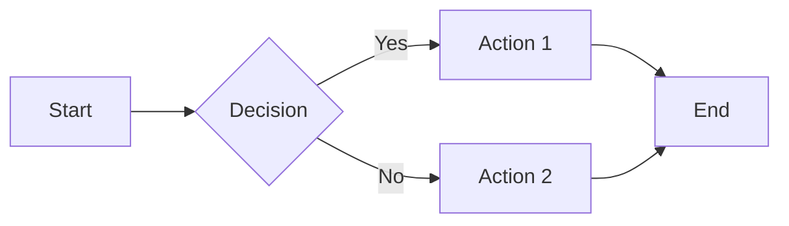
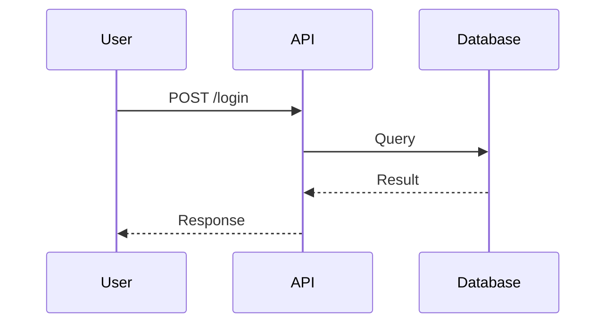
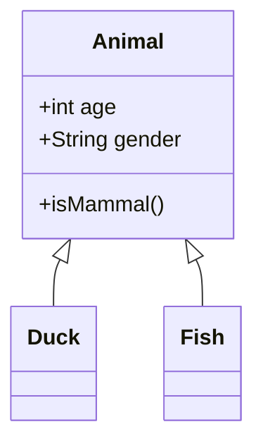

# Mermaid Image Generator

Convert Mermaid diagram syntax to PNG/SVG images using the mermaid.ink online rendering API. **Zero dependencies** - uses only Node.js built-in modules and curl.

## Quick Start

```bash
# From a .mmd file
node scripts/mermaid-to-image.js diagram.mmd output.png

# From stdin
echo "flowchart LR; A --> B" | node scripts/mermaid-to-image.js - output.png

# Generate SVG instead
node scripts/mermaid-to-image.js diagram.mmd output.svg
```

## When to Use This Skill

Use this skill when:
- User asks to "draw a diagram", "create a flowchart", "make a visual"
- User needs diagram images for PPTs, documentation, or presentations
- User wants to convert Mermaid code to shareable image files
- Local Mermaid CLI (mmdc) is unavailable or has dependency issues

## Script Usage

### Basic Conversion

```bash
node scripts/mermaid-to-image.js <input> <output>
```

**Input options:**
- File path: `diagram.mmd`
- Stdin: `-` (pipe Mermaid code directly)

**Output format:** Determined by file extension (`.png` or `.svg`)

### Examples

**Example 1: Convert file to PNG**
```bash
node scripts/mermaid-to-image.js flowchart.mmd flowchart.png
```

**Example 2: Pipe from stdin**
```bash
cat <<EOF | node scripts/mermaid-to-image.js - sequence.png
sequenceDiagram
    Alice->>Bob: Hello
    Bob-->>Alice: Hi
EOF
```

**Example 3: Generate SVG for web**
```bash
node scripts/mermaid-to-image.js architecture.mmd architecture.svg
```

## Mermaid Diagram Types

This skill supports all Mermaid diagram types:

| Type | Use Case |
|------|----------|
| `flowchart` | Processes, algorithms, user journeys |
| `sequenceDiagram` | API flows, interactions over time |
| `classDiagram` | OOP design, domain models |
| `erDiagram` | Database schemas |
| `stateDiagram` | State machines |
| `gantt` | Project timelines |
| `pie` | Proportional data |
| `gitGraph` | Git branching strategies |

## Example Mermaid Code

### Flowchart


### Sequence Diagram


### Class Diagram


## API Details

**Service:** mermaid.ink
**Endpoints:**
- PNG: `https://mermaid.ink/img/{base64_code}`
- SVG: `https://mermaid.ink/svg/{base64_code}`

**Advantages:**
- ✅ No local dependencies (no Chrome/Puppeteer needed)
- ✅ Free and fast
- ✅ Returns high-quality PNG/SVG
- ✅ Works in headless environments

**Limitations:**
- Requires internet connection
- Diagram code is sent to external service (don't use for sensitive data)

## Error Handling

The script handles common errors:

```
❌ File not found: diagram.mmd
❌ API request failed: 400 Bad Request
❌ Failed to connect to mermaid.ink: Connection timeout
```

**Troubleshooting:**
1. Check internet connectivity
2. Verify Mermaid syntax at https://mermaid.live
3. Ensure output directory exists (script creates it automatically)

## Integration Pattern

When creating diagrams for users:

1. **Write Mermaid code** → Save to `.mmd` file or use stdin
2. **Run conversion script** → Generate PNG/SVG
3. **Send/deliver image** → Attach to response or save to specified location

**Example workflow:**
```bash
# 1. Create diagram
cat > openclaw-flow.mmd <<EOF
flowchart LR
    User --> OpenClaw
    OpenClaw --> Tools
EOF

# 2. Convert to image
node scripts/mermaid-to-image.js openclaw-flow.mmd openclaw-flow.png

# 3. Use the image (send via message, save, etc.)
```

## Best Practices

1. **Keep diagrams simple** - Under 15 nodes for readability
2. **Use meaningful labels** - Self-documenting diagrams
3. **Test syntax first** - Validate at mermaid.live before converting
4. **Choose format wisely** - PNG for PPTs, SVG for web/docs
5. **Add comments** - Use `%%` for in-diagram documentation

## Security Notes

- Diagram code is sent to mermaid.ink API
- Do not include sensitive information in diagrams
- For sensitive data, use local Mermaid CLI instead
